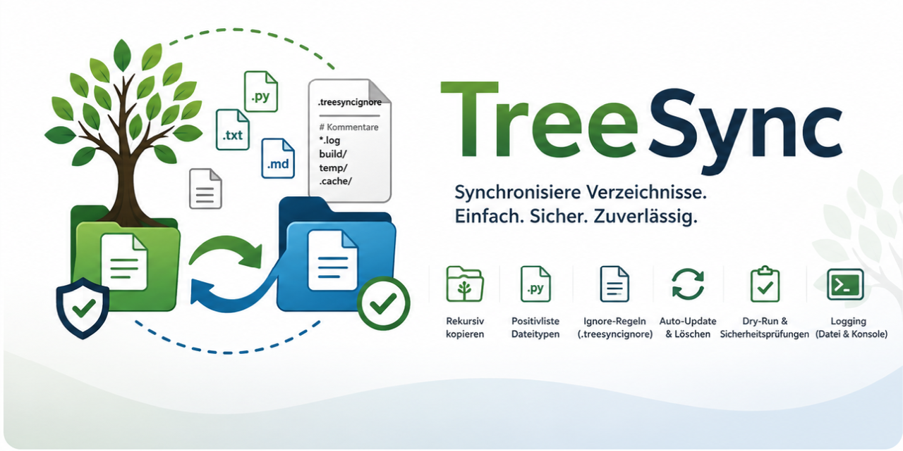

# TreeSync



`treesync` ist ein CLI-Tool in C# auf Basis von .NET 10 zum synchronen Copy-Deployment einer Verzeichnisstruktur.

Das Tool kopiert Dateien aus einer Quelle in ein Zielverzeichnis, erhält die Ordnerstruktur, berücksichtigt eine Positivliste von Dateitypen und wendet Ignore‑Regeln an. Dateien oder Verzeichnisse, die im Ziel existieren, aber nicht mehr in der Quelle vorhanden sind, werden gelöscht.

Das Zielverzeichnis stellt damit stets eine synchronisierte Kopie der Quelle dar.

---

## Hauptfunktionen

- rekursives Kopieren einer Verzeichnisstruktur

- Positivliste erlaubter Dateiendungen

- Ignore‑Datei ähnlich `.gitignore` (vereinfachte Syntax)

- automatisches Update geänderter Dateien

- Entfernen nicht mehr vorhandener Dateien im Ziel

- Dry‑Run Modus

- Logging in Datei und Konsole

- Sicherheitsprüfungen vor Ausführung

---

## Technologie

- Programmiersprache: C#
- Runtime/SDK: .NET 10
- Anwendungstyp: .NET Console App
- Default Namespace: `clausTrarius.TreeSync`

---

## Voraussetzungen

- .NET 10 SDK

Prüfen mit:

```
dotnet --list-sdks
```

Für Entwicklung, Build und Tests muss ein `10.x` SDK installiert sein, da alle Projekte `net10.0` targeten.

---

## Projektstruktur

Der Code folgt der Architektur aus `docs/architecture.md`:

- `src/TreeSync.Cli`: CLI-Parsing, Top-Level-Fehlerbehandlung und Exitcodes
- `src/TreeSync.Core`: Konfiguration, Logging, Ignore-Regeln, Scanning, Vergleich, Safety und Sync-Engine
- `tests/TreeSync.Tests`: xUnit-Tests für die zentralen Komponenten

---

## Nutzung als EXE

Für ein direkt startbares Windows-Executable muss das CLI-Projekt veröffentlicht werden:

```powershell
dotnet publish src/TreeSync.Cli/TreeSync.Cli.csproj `
  -c Release `
  -p:PublishProfile=win-x64-folder
```

Die erzeugten Dateien liegen danach hier:

```text
publish/TreeSync.exe
```

Nach dem Publish kann `TreeSync.exe` direkt ohne Sourcecode und ohne installierte .NET Runtime verwendet werden.

```powershell
.\TreeSync.exe `
  --source "C:\pfad\zur\quelle" `
  --target "C:\pfad\zum\ziel" `
  --config "C:\pfad\zur\quelle\config.json" `
  --ignore "C:\pfad\zur\quelle\.treesyncignore" `
  --log "treesync.log" `
  --log-level info
```

`--config`, `--ignore`, `--log` und `--log-level` sind optional.

Dry Run:

```powershell
.\TreeSync.exe `
  --source "C:\pfad\zur\quelle" `
  --target "C:\pfad\zum\ziel" `
  --dry-run
```

## Nutzung unter Linux

Für Linux steht zusätzlich ein self-contained `linux-x64`-Build zur Verfügung:

```bash
dotnet publish src/TreeSync.Cli/TreeSync.Cli.csproj \
  --configuration Release \
  --runtime linux-x64 \
  --self-contained true \
  -p:PublishSingleFile=true \
  -p:EnableCompressionInSingleFile=true \
  -p:DebugType=none \
  -p:DebugSymbols=false \
  --output publish/linux-x64
```

Danach kann das Binary direkt gestartet werden:

```bash
./publish/linux-x64/TreeSync \
  --source ./src \
  --target /var/www/app \
  --config ./config.json \
  --ignore ./.treesyncignore \
  --log ./treesync.log \
  --log-level info
```

## Nutzung mit installierter .NET Runtime

Für Systeme mit installierter .NET 10 Runtime gibt es zusätzlich ein framework-dependent Paket:

```bash
dotnet publish src/TreeSync.Cli/TreeSync.Cli.csproj \
  --configuration Release \
  --self-contained false \
  -p:UseAppHost=false \
  --output publish/dotnet
```

Start:

```bash
dotnet ./publish/dotnet/TreeSync.dll \
  --source ./src \
  --target /var/www/app
```

---

## Beispielaufruf

```

treesync \\

&#x20; --source ./src \\

&#x20; --target /var/www/app \\

&#x20; --config ./config.json \\

&#x20; --ignore .treesyncignore \\

&#x20; --log treesync.log \\

&#x20; --log-level info

```

---

## Dry Run

```

treesync --source ./src --target /var/www/app --dry-run

```

Zeigt alle Aktionen an, ohne Änderungen vorzunehmen.

---

## Build und Tests

```
dotnet restore TreeSync.sln
dotnet build TreeSync.sln --configuration Release
dotnet test TreeSync.sln --configuration Release
```

`dotnet build` ist für Entwicklung und Tests gedacht. Für verteilbare Windows-, Linux- oder `.NET`-Artefakte bitte `dotnet publish` wie oben verwenden.

Releases enthalten zusätzlich ein Linux-Artefakt (`TreeSync-<version>-linux-x64.tar.gz`) sowie ein framework-dependent `.NET`-Paket (`TreeSync-<version>-dotnet.zip`).

---

## Release

Releases werden über Git-Tags im Format `vMAJOR.MINOR.PATCH` erstellt:

```powershell
git tag v1.2.3
git push origin v1.2.3
```

Der Tag-Push startet den GitHub Actions Release-Workflow. Details stehen in `docs/release-pipeline.md` und `docs/create-release.md`.

---

## VSCode/Cursor

Die Workspace-Konfiguration liegt in `.vscode/`:

- `launch.json`: Debug-Konfiguration `TreeSync CLI: Debug` mit Dry-Run
- `tasks.json`: Tasks für Restore, Build, Test und Publish
- `settings.json`: `TreeSync.sln` als Default-Solution
- `extensions.json`: empfohlene C#/.NET-Erweiterungen

Die Publish-Tasks erzeugen Windows-, Linux- und framework-dependent `.NET`-Artefakte im Ordner `publish`.

---

## Exitcodes

- `0`: Erfolg
- `1`: CLI- oder Konfigurationsfehler
- `2`: Sicherheitsprüfung fehlgeschlagen
- `3`: unerwarteter Laufzeitfehler

---

## Standarddateien

Wenn nicht anders angegeben, erwartet das Tool folgende Dateien im Root der Quelle:

- `config.json`

- `.treesyncignore`

---

## Konfiguration

Siehe: [`docs/configuration.md`](docs/configuration.md)

---

## Ignore-Regeln

Siehe: [`docs/ignore-rules.md`](docs/ignore-rules.md)

---

## Synchronisationslogik

Siehe: [`docs/sync-logic.md`](docs/sync-logic.md)

---

## CLI-Interface

Siehe: [`docs/cli.md`](docs/cli.md)
