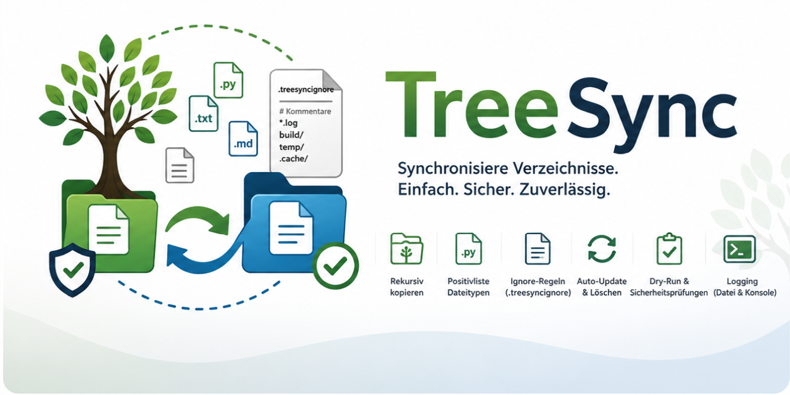

# TreeSync



`treesync` ist ein CLI-Tool in C# auf Basis von .NET 10 zum synchronen Copy-Deployment einer Verzeichnisstruktur.

Das Tool kopiert Dateien aus einer Quelle in ein Zielverzeichnis, erhält die Ordnerstruktur, berücksichtigt eine Positivliste von Dateitypen und wendet Ignore-Regeln an. Dateien oder Verzeichnisse, die im Ziel existieren, aber nicht mehr in der Quelle vorhanden sind, werden gelöscht.

Das Zielverzeichnis stellt damit stets eine synchronisierte Kopie der Quelle dar.

---

## Parameter

| Parameter | Pflicht | Beschreibung | Standard |
| --- | --- | --- | --- |
| `--source <path>` | ja | Pfad zum Quellverzeichnis | - |
| `--target <path>` | ja | Pfad zum Zielverzeichnis | - |
| `--config <file>` | nein | Pfad zur Konfigurationsdatei | `config.json` im Root der Quelle |
| `--ignore <file>` | nein | Pfad zur Ignore-Datei | `.treesyncignore` im Root der Quelle |
| `--log <file>` | nein | Pfad zur Logdatei | `treesync.log` im aktuellen Arbeitsverzeichnis |
| `--log-level <level>` | nein | Logging-Level (`error`, `info`, `debug`) | Wert aus Konfiguration |
| `--dry-run` | nein | Simuliert alle Aktionen ohne Änderungen am Dateisystem | `false` |

---

## Beispielaufruf

```bash
./TreeSync \
  --source ./src \
  --target /var/www/app \
  --config ./config.json \
  --ignore ./.treesyncignore \
  --log ./treesync.log \
  --log-level info
```

Dry Run:

```bash
./TreeSync --source ./src --target /var/www/app --dry-run
```

---

## Weiterführende Dokumentation

Projektspezifische Entwicklungs- und Release-Details wurden in eigene Dateien ausgelagert:

- [`docs/development.md`](docs/development.md)
- [`docs/architecture.md`](docs/architecture.md)
- [`docs/cli.md`](docs/cli.md)
- [`docs/configuration.md`](docs/configuration.md)
- [`docs/ignore-rules.md`](docs/ignore-rules.md)
- [`docs/sync-logic.md`](docs/sync-logic.md)
- [`docs/create-release.md`](docs/create-release.md)
- [`docs/release-pipeline.md`](docs/release-pipeline.md)

---

## Copyright & License

© 2024-present clausTrarius. Licensed under MIT.
